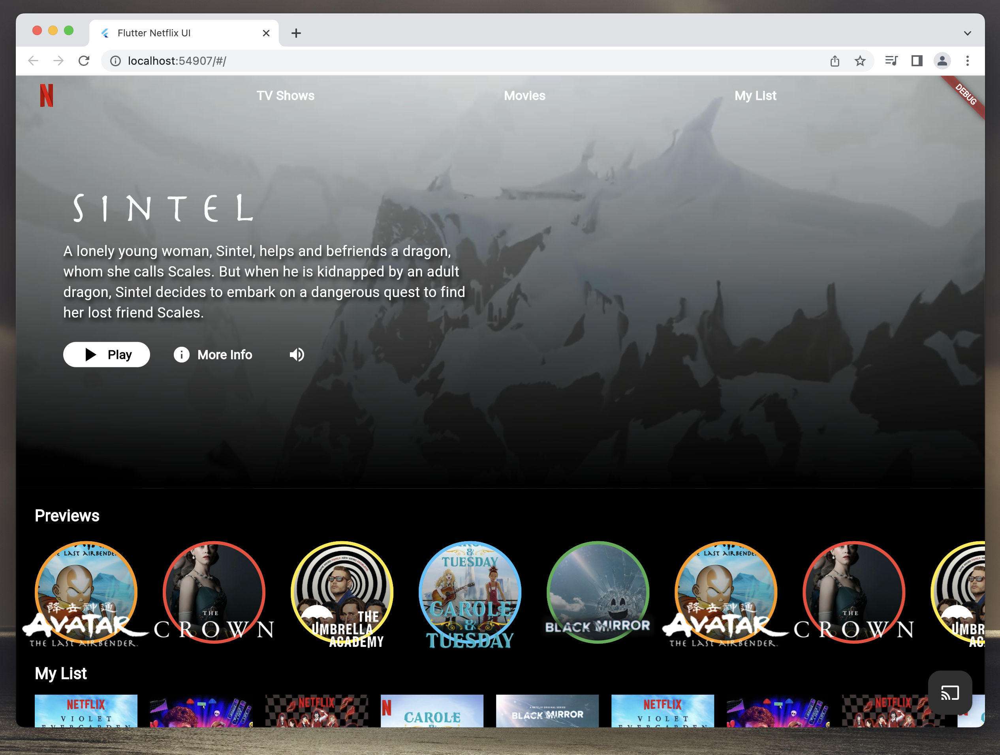

# Netflix Clone

This is a Netflix-inspired interface project developed to practice and enhance my Flutter skills.

## Description

The project involves replicating the Netflix app interface using Flutter to build responsive screens for web and mobile devices. Flutter widgets and resources were utilized to create a visually similar interface to the original app. This project is purely educational and not affiliated with the Netflix company.

## Motivation

Creating this Netflix interface clone aims to provide hands-on experience and improve mobile app development skills using Flutter. The project serves as an exercise to explore layout structure, component organization and user interface interaction.

## Disclaimer

This project is a recreation of the Netflix interface and is for educational and training purposes only. I have no affiliation or association with Netflix. The use of this project and its source code is entirely at the user's own risk. I am not responsible for any misuse, copyright infringement, or other consequences resulting from the use of this project.

## Screenshots

## How to Run the Project

1. Clone this repository.
2. Make sure you have the Flutter development environment properly set up.
3. Navigate to the project directory in the terminal.
4. Run the command `flutter pub get` and after that run `flutter run` to start the application.

## Contribution

Contributions are welcome! If you have any suggestions, bug fixes, or improvements, feel free to open an issue or submit a pull request.

## Contact

If you have any questions or need to get in touch with me, you can find me on GitHub or through the following channels:

- Email: igorqueirozdev@outlook.com
- LinkedIn: [Igor Queiroz](https://www.linkedin.com/in/igor-queiroz-iq21/)

